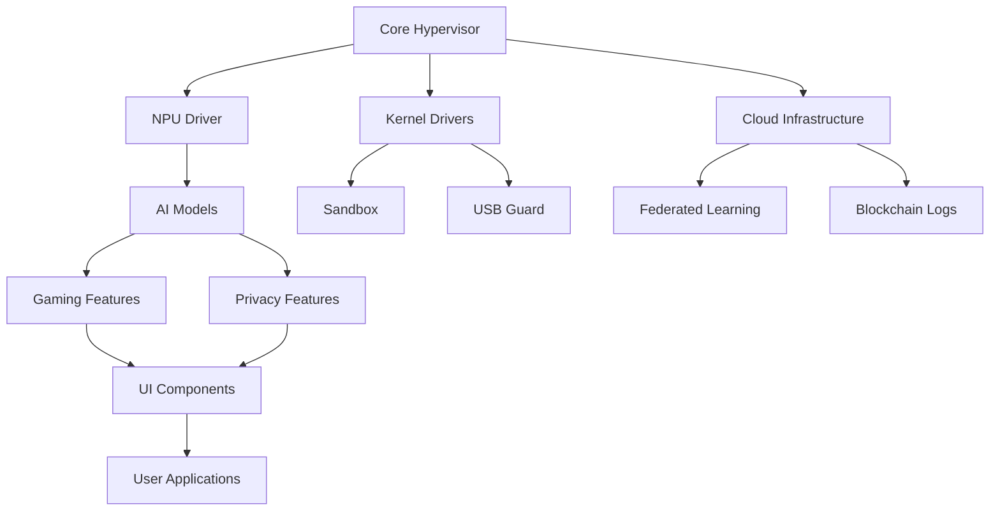

# SENTINEL - Developer Documentation Guide
## Comprehensive Guide for Developers

---

## WPROWADZENIE

### Cel Dokumentacji
Zapewnienie kompleksowego przewodnika dla deweloperów pracujących nad SENTINEL, obejmującego architekturę, coding standards, workflow, best practices i narzędzia deweloperskie.

### Target Audience
- Core developers (Rust, C++, Assembly)
- AI/ML engineers
- Frontend developers (WebGPU, UI)
- QA engineers
- DevOps engineers

---

## ARCHITEKTURA DLA DEWELOPERÓW

### 1. Struktura Projektu

```
sentinel/
├── core/                          # Core hypervisor and kernel components
│   ├── hypervisor/               # Ring -1 hypervisor (Rust)
│   │   ├── src/
│   │   │   ├── main.rs
│   │   │   ├── daemon.rs
│   │   │   ├── memory/
│   │   │   │   ├── inspector.rs
│   │   │   │   └── zero_copy.rs
│   │   │   ├── process/
│   │   │   │   ├── monitor.rs
│   │   │   │   └── sandbox.rs
│   │   │   └── hardware/
│   │   │       ├── iommu.rs
│   │   │       └── tpm.rs
│   │   └── Cargo.toml
│   └── kernel/                   # Kernel drivers (C++)
│       ├── src/
│       │   ├── sandbox/
│       │   ├── cdr/
│       │   └── usb_guard/
│       └── CMakeLists.txt
│
├── ai/                            # AI/ML components
│   ├── npu_driver/               # NPU offloading (Rust)
│   ├── models/                   # AI models
│   │   ├── llm/
│   │   ├── gnn/
│   │   └── vision/
│   ├── training/                 # Training scripts
│   └── python/                   # Python ML code
│
├── gaming/                       # Gaming features
│   ├── anti_cheat/               # Trusted Handshake
│   ├── overclocking/             # AI Overclocking
│   ├── audio/                    # Visual Audio Matrix
│   └── privacy_blur/             # Streamer Privacy Blur
│
├── ui/                           # User interface
│   ├── engine/                   # Nano-Fluidic UI Engine
│   ├── dashboard/                # Orbital Dashboard 3D
│   └── webgpu/                   # WebGPU shaders
│
├── privacy/                      # Privacy features
│   ├── biometrics/               # Continuous Biometric Auth
│   ├── spoofing/                 # Data Spoofing
│   └── content_filter/           # Content Safety Filter
│
├── network/                      # Network components
│   ├── vpn/                      # Secure VPN
│   ├── ddos_shield/              # Anti-DDoS
│   └── geo_routing/              # Geo-Routing
│
├── cloud/                        # Cloud infrastructure
│   ├── federated_learning/       # Federated Learning Network
│   ├── blockchain/               # Immutable Blockchain Logs
│   └── post_quantum/             # Post-Quantum Cryptography
│
├── tests/                        # Tests
│   ├── unit/
│   ├── integration/
│   ├── e2e/
│   └── benchmarks/
│
├── docs/                         # Documentation
│   ├── api/
│   ├── architecture/
│   └── guides/
│
├── scripts/                      # Utility scripts
│   ├── build.sh
│   ├── test.sh
│   └── deploy.sh
│
└── .github/                      # GitHub workflows
    └── workflows/
        ├── ci.yml
        └── cd.yml
```

### 2. Component Dependencies



---

## CODING STANDARDS

### 1. Rust Coding Standards

#### 1.1 Naming Conventions
```rust
// Structs and Enums: PascalCase
struct ZeroCopyInspector {
    // Fields: snake_case
    memory_regions: Vec<MemoryRegion>,
}

enum ProcessEvent {
    Create { pid: Pid, path: PathBuf },
    Terminate { pid: Pid },
}

// Functions and Methods: snake_case
impl ZeroCopyInspector {
    fn inspect_region(&amp;self, addr: VirtAddr) -> &amp;MemoryRegion {
        // ...
    }
}

// Constants: SCREAMING_SNAKE_CASE
const MAX_REGION_SIZE: usize = 1024 * 1024 * 1024; // 1GB
```

#### 1.2 Error Handling
```rust
use thiserror::Error;

#[derive(Error, Debug)]
pub enum InspectorError {
    #[error("Memory region not found at address {0}")]
    RegionNotFound(VirtAddr),
    
    #[error("Permission denied for memory access")]
    PermissionDenied,
    
    #[error("Hardware error: {0}")]
    HardwareError(#[from] HardwareError),
}

impl ZeroCopyInspector {
    pub fn inspect(&amp;self, addr: VirtAddr) -> Result<&amp;MemoryRegion, InspectorError> {
        let region = self.find_region(addr)
            .ok_or(InspectorError::RegionNotFound(addr))?;
        
        self.check_permissions(&amp;region)?;
        
        Ok(region)
    }
}
```

#### 1.3 Documentation
```rust
/// Inspects a memory region without copying data.
///
/// # Arguments
///
/// * `addr` - The virtual address to inspect
///
/// # Returns
///
/// A reference to the memory region
///
/// # Errors
///
/// Returns an error if:
/// - The address is not mapped
/// - Access permissions are insufficient
///
/// # Examples
///
/// ```
/// let inspector = ZeroCopyInspector::new();
/// let region = inspector.inspect(0x1000)?;
/// ```
pub fn inspect(&amp;self, addr: VirtAddr) -> Result<&amp;MemoryRegion, InspectorError> {
    // Implementation
}

#[cfg(test)]
mod tests {
    use super::*;

    #[test]
    fn test_inspect_valid_address() {
        let inspector = ZeroCopyInspector::new();
        let result = inspector.inspect(0x1000);
        
        assert!(result.is_ok());
    }
}
```

#### 1.4 Async/Await Patterns
```rust
use tokio::time::{timeout, Duration};

impl SentinelDaemon {
    /// Runs the main daemon loop with timeout handling
    pub async fn run(&amp;mut self) -> Result<(), DaemonError> {
        loop {
            // Timeout each operation to prevent hanging
            let result = timeout(
                Duration::from_secs(5),
                self.monitor_processes()
            ).await;
            
            match result {
                Ok(Ok(())) => {},
                Ok(Err(e)) => return Err(DaemonError::MonitorError(e)),
                Err(_) => {
                    log::warn!("Process monitoring timed out");
                    continue;
                }
            }
        }
    }
}
```

### 2. C++ Coding Standards

#### 2.1 Naming Conventions
```cpp
// Classes: PascalCase
class IOMMUManager {
private:
    // Member variables: m_camelCase
    std::unordered_map<DeviceId, IOMMUGroup> m_deviceGroups;
    DMAShield* m_dmaShield;

public:
    // Methods: PascalCase
    int RegisterDevice(const Device&amp; device);
    int AuthorizeDMA(const Device* device, const std::vector<MemRegion>&amp; regions);
};
```

#### 2.2 Smart Pointers and Memory Management
```cpp
class Sandbox {
private:
    std::unique_ptr<Namespace> m_namespace;
    std::shared_ptr<CgroupSet> m_cgroups;

public:
    // Use unique_ptr for exclusive ownership
    Sandbox() : m_namespace(std::make_unique<Namespace>()) {}

    // Use shared_ptr for shared ownership
    void AttachCgroup(std::shared_ptr<CgroupSet> cgroup) {
        m_cgroups = cgroup;
    }
};
```

#### 2.3 RAII Pattern
```cpp
class ScopedFile {
private:
    int m_fd;

public:
    explicit ScopedFile(const char* path, int flags) {
        m_fd = open(path, flags);
        if (m_fd < 0) {
            throw std::runtime_error("Failed to open file");
        }
    }

    ~ScopedFile() {
        if (m_fd >= 0) {
            close(m_fd);
        }
    }

    // Delete copy constructor and assignment
    ScopedFile(const ScopedFile&amp;) = delete;
    ScopedFile&amp; operator=(const ScopedFile&amp;) = delete;
};
```

### 3. Python Coding Standards

#### 3.1 Type Hints
```python
from typing import List, Optional, Dict, Any
from pathlib import Path

def analyze_script(script: str, 
                   model: LLMModel, 
                   confidence_threshold: float = 0.9) -> Optional[Intent]:
    """
    Analyzes a script for malicious intent.
    
    Args:
        script: The script to analyze
        model: The LLM model to use
        confidence_threshold: Minimum confidence to classify as malicious
    
    Returns:
        Intent object if analysis successful, None otherwise
    """
    tokens = model.tokenize(script)
    prediction = model.predict(tokens)
    
    if prediction.confidence >= confidence_threshold:
        return Intent(
            type=prediction.type,
            confidence=prediction.confidence,
            reasoning=prediction.reasoning
        )
    
    return None
```

#### 3.2 Async/Await Patterns
```python
import asyncio
from dataclasses import dataclass

@dataclass
class InferenceResult:
    output: Tensor
    latency: float

async def run_inference_batch(model: LLMModel, 
                               inputs: List[Tensor]) -> List[InferenceResult]:
    """
    Run inference on a batch of inputs concurrently.
    """
    async def single_inference(input_tensor: Tensor) -> InferenceResult:
        start = time.time()
        output = await model.predict_async(input_tensor)
        latency = time.time() - start
        return InferenceResult(output=output, latency=latency)
    
    # Run all inferences concurrently
    tasks = [single_inference(inp) for inp in inputs]
    results = await asyncio.gather(*tasks, return_exceptions=True)
    
    return results
```

---

## DEVELOPMENT WORKFLOW

### 1. Setting Up Development Environment

#### 1.1 Prerequisites
```bash
# Install Rust
curl --proto '=https' --tlsv1.2 -sSf https://sh.rustup.rs | sh
rustup component add rust-analyzer
rustup component add clippy

# Install C++ toolchain (Ubuntu)
sudo apt-get install build-essential cmake clang-format

# Install Python
python3 -m pip install --upgrade pip
pip install pytest mypy black pylint

# Install Node.js (for WebGPU development)
curl -fsSL https://deb.nodesource.com/setup_20.x | sudo -E bash -
sudo apt-get install -y nodejs

# Install development tools
sudo apt-get install git tmux vim tree jq
```

#### 1.2 Clone and Setup
```bash
# Clone repository
git clone https://github.com/vantisos/sentinel.git
cd sentinel

# Initialize git hooks
./scripts/init_git_hooks.sh

# Install Rust dependencies
cd core/hypervisor
cargo build --release

# Install Python dependencies
cd ../../ai/python
pip install -r requirements.txt
pip install -r requirements-dev.txt

# Install Node.js dependencies
cd ../../ui/webgpu
npm install
```

#### 1.3 Configure IDE
```json
// .vscode/settings.json
{
    "rust-analyzer.cargo.loadOutDirsFromCheck": true,
    "rust-analyzer.checkOnSave.command": "clippy",
    "C_Cpp.default.configurationProvider": "ms-vscode.cmake-tools",
    "python.linting.enabled": true,
    "python.linting.pylintEnabled": true,
    "python.formatting.provider": "black"
}
```

### 2. Git Workflow

#### 2.1 Branch Naming Convention
```
feature/zero-copy-memory-inspection
feature/npu-offloading-driver
bugfix/iommu-isolation-leak
hotfix/critical-security-patch
refactor/sandbox-engine
docs/update-api-documentation
```

#### 2.2 Commit Message Format
```
<type>(<scope>): <subject>

<body>

<footer>
```

**Types:**
- `feat`: New feature
- `fix`: Bug fix
- `docs`: Documentation changes
- `style`: Code style changes (formatting)
- `refactor`: Code refactoring
- `perf`: Performance improvements
- `test`: Adding or updating tests
- `chore`: Maintenance tasks

**Example:**
```
feat(hypervisor): implement zero-copy memory inspection

Implement zero-copy memory inspection to eliminate overhead
when inspecting RAM. Uses direct memory mapping and avoids
data copying between kernel and user space.

Performance: <10μs latency, >10GB/s throughput
CPU overhead: <1%

Closes #123
```

#### 2.3 Pull Request Process
```bash
# Create feature branch
git checkout -b feature/zero-copy-memory-inspection

# Make changes and commit
git add .
git commit -m "feat(hypervisor): implement zero-copy memory inspection"

# Push and create PR
git push origin feature/zero-copy-memory-inspection
```

**PR Template:**
```markdown
## Description
Brief description of changes

## Type of Change
- [ ] Bug fix
- [ ] New feature
- [ ] Breaking change
- [ ] Documentation update

## Testing
- [ ] Unit tests added/updated
- [ ] Integration tests added/updated
- [ ] All tests passing

## Checklist
- [ ] Code follows style guidelines
- [ ] Self-review completed
- [ ] Comments added for complex logic
- [ ] Documentation updated
- [ ] No new warnings generated

## Related Issues
Closes #123
```

### 3. Build System

#### 3.1 Rust Build
```bash
# Debug build
cargo build

# Release build
cargo build --release

# Run tests
cargo test

# Run clippy
cargo clippy -- -D warnings

# Check code
cargo check

# Format code
cargo fmt
```

#### 3.2 C++ Build
```bash
# Configure CMake
mkdir build &amp;&amp; cd build
cmake .. -DCMAKE_BUILD_TYPE=Release

# Build
cmake --build . --parallel

# Run tests
ctest --output-on-failure

# Format code
clang-format -i src/*.cpp
```

#### 3.3 Python Build
```bash
# Install in development mode
pip install -e .

# Run tests
pytest tests/

# Type checking
mypy sentinel/

# Format code
black sentinel/
pylint sentinel/
```

#### 3.4 Unified Build Script
```bash
#!/bin/bash
# scripts/build.sh

set -e

echo "Building SENTINEL..."

# Build Rust components
echo "Building Rust components..."
cd core/hypervisor
cargo build --release

# Build C++ components
echo "Building C++ components..."
cd ../kernel
mkdir -p build &amp;&amp; cd build
cmake .. -DCMAKE_BUILD_TYPE=Release
cmake --build . --parallel

# Build Python components
echo "Building Python components..."
cd ../../../ai/python
pip install -e .

echo "Build completed successfully!"
```

---

## TESTING FOR DEVELOPERS

### 1. Running Tests

#### 1.1 Unit Tests
```bash
# Rust unit tests
cargo test --lib

# C++ unit tests
cd build &amp;&amp; ctest -R unit

# Python unit tests
pytest tests/unit/
```

#### 1.2 Integration Tests
```bash
# Rust integration tests
cargo test --test integration

# Python integration tests
pytest tests/integration/
```

#### 1.3 End-to-End Tests
```bash
# Run E2E tests (requires full environment)
pytest tests/e2e/
```

#### 1.4 All Tests
```bash
# Run all tests
./scripts/run_all_tests.sh
```

### 2. Writing Tests

#### 2.1 Rust Tests
```rust
#[cfg(test)]
mod tests {
    use super::*;

    #[test]
    fn test_inspector_creation() {
        let inspector = ZeroCopyInspector::new();
        assert!(inspector.is_initialized());
    }

    #[test]
    fn test_region_inspection() {
        let inspector = ZeroCopyInspector::new();
        let region = create_test_region();
        
        let result = inspector.inspect(region.base_addr());
        
        assert!(result.is_ok());
    }
}
```

#### 2.2 C++ Tests
```cpp
TEST(IOMMUManagerTest, RegisterDevice) {
    IOMMUManager manager;
    MockDevice device("test_device");
    
    int result = manager.RegisterDevice(device);
    
    EXPECT_EQ(result, 0);
    EXPECT_TRUE(manager.IsDeviceRegistered(device.id));
}
```

#### 2.3 Python Tests
```python
def test_llm_analyzer():
    analyzer = LLMAnalyzer()
    script = "print('hello')"
    
    intent = analyzer.analyze_intent(script)
    
    assert intent.type == "benign"
    assert intent.confidence > 0.8
```

---

## DEBUGGING

### 1. Rust Debugging

#### 1.1 Logging
```rust
use log::{debug, info, warn, error};

impl ZeroCopyInspector {
    pub fn inspect(&amp;self, addr: VirtAddr) -> Result<&amp;MemoryRegion, InspectorError> {
        debug!("Inspecting address: 0x{:x}", addr);
        
        let region = self.find_region(addr)?;
        info!("Found region: {:?}", region);
        
        Ok(region)
    }
}
```

#### 1.2 Using `dbg!` macro
```rust
pub fn calculate_risk(score: f64) -> RiskLevel {
    dbg!(score); // Prints value and line number
    // ...
}
```

#### 1.3 GDB Integration
```bash
# Build with debug symbols
cargo build

# Run with GDB
gdb target/debug/sentinel-daemon
(gdb) break sentinel_core::hypervisor::main
(gdb) run
```

### 2. C++ Debugging

#### 2.1 Logging
```cpp
#include <spdlog/spdlog.h>

class IOMMUManager {
public:
    int RegisterDevice(const Device&amp; device) {
        spdlog::debug("Registering device: {}", device.id);
        
        // Implementation
        spdlog::info("Device registered successfully: {}", device.id);
        
        return 0;
    }
};
```

#### 2.2 GDB
```bash
# Build with debug symbols
cmake -DCMAKE_BUILD_TYPE=Debug ..
cmake --build .

# Run with GDB
gdb ./sentinel-daemon
(gdb) break IOMMUManager::RegisterDevice
(gdb) run
```

### 3. Python Debugging

#### 3.1 Logging
```python
import logging

logger = logging.getLogger(__name__)

def analyze_script(script: str) -> Intent:
    logger.debug(f"Analyzing script: {script[:50]}...")
    
    intent = llm_model.predict(script)
    
    logger.info(f"Analysis complete: {intent.type}")
    return intent
```

#### 3.2 pdb
```python
import pdb

def analyze_script(script: str) -> Intent:
    # Set breakpoint
    pdb.set_trace()
    
    intent = llm_model.predict(script)
    return intent
```

---

## PERFORMANCE PROFILING

### 1. Rust Profiling

#### 1.1 Criterion Benchmarks
```rust
use criterion::{criterion_group, criterion_main, Criterion};

fn bench_inspection(c: &amp;mut Criterion) {
    let inspector = ZeroCopyInspector::new();
    let region = MemoryRegion::large(1024 * 1024 * 100);
    
    c.bench_function("inspect_100mb", |b| {
        b.iter(|| inspector.inspect(&amp;region))
    });
}

criterion_group!(benches, bench_inspection);
criterion_main!(benches);
```

#### 1.2 Flamegraph
```bash
# Install flamegraph
cargo install flamegraph

# Generate flamegraph
cargo flamegraph --bin sentinel-daemon
```

### 2. C++ Profiling

#### 2.1 gprof
```bash
# Build with profiling
cmake -DCMAKE_BUILD_TYPE=Profile ..
cmake --build .

# Run and generate profile
./sentinel-daemon
gprof sentinel-daemon gmon.out > analysis.txt
```

### 3. Python Profiling

#### 3.1 cProfile
```python
import cProfile

def main():
    # Your code here
    pass

if __name__ == "__main__":
    cProfile.run("main()", sort="cumtime")
```

---

## DOCUMENTATION

### 1. Code Documentation

#### 1.1 Rust Documentation
```rust
/// Represents a memory region that can be inspected.
///
/// # Fields
///
/// * `base_addr` - The base virtual address of the region
/// * `size` - The size of the region in bytes
/// * `permissions` - Access permissions for the region
///
/// # Examples
///
/// ```
/// let region = MemoryRegion::new(0x1000, 4096, Permissions::READ | Permissions::WRITE);
/// ```
pub struct MemoryRegion {
    base_addr: VirtAddr,
    size: usize,
    permissions: Permissions,
}

impl MemoryRegion {
    /// Creates a new memory region.
    ///
    /// # Arguments
    ///
    /// * `base_addr` - Base virtual address
    /// * `size` - Size in bytes
    /// * `permissions` - Access permissions
    ///
    /// # Returns
    ///
    /// A new MemoryRegion instance
    pub fn new(base_addr: VirtAddr, size: usize, permissions: Permissions) -> Self {
        MemoryRegion {
            base_addr,
            size,
            permissions,
        }
    }
}
```

#### 1.2 C++ Documentation
```cpp
/**
 * @brief Manages IOMMU device isolation and DMA protection.
 * 
 * This class handles registration of devices, IOMMU group management,
 * and DMA authorization for enhanced security.
 * 
 * @note All operations are thread-safe.
 * @see DMAShield
 */
class IOMMUManager {
public:
    /**
     * @brief Register a device with IOMMU protection.
     * 
     * @param device The device to register
     * @return 0 on success, error code on failure
     * 
     * @throws std::runtime_error if IOMMU is not available
     */
    int RegisterDevice(const Device&amp; device);
};
```

### 2. API Documentation

Generate with:
```bash
# Rust
cargo doc --no-deps --open

# C++ (Doxygen)
doxygen Doxyfile

# Python (Sphinx)
sphinx-build -b html docs/source docs/build
```

---

## BEST PRACTICES

### 1. Code Quality

#### 1.1 Before Committing
```bash
# Run all checks
./scripts/pre-commit-check.sh
```

Pre-commit checks:
```bash
#!/bin/bash
# scripts/pre-commit-check.sh

echo "Running pre-commit checks..."

# Format code
cargo fmt
black .

# Run linters
cargo clippy -- -D warnings
pylint sentinel/

# Run tests
cargo test
pytest tests/unit/ tests/integration/

# Check for security issues
cargo-audit
safety check

echo "All checks passed!"
```

#### 1.2 Code Review Checklist
- [ ] Code follows style guidelines
- [ ] Tests are comprehensive
- [ ] Documentation is updated
- [ ] No security vulnerabilities
- [ ] Performance is acceptable
- [ ] Error handling is proper
- [ ] Logging is adequate

### 2. Security Best Practices

#### 2.1 Input Validation
```rust
pub fn sanitize_path(path: &amp;str) -> Result<PathBuf, SecurityError> {
    // Validate path doesn't contain directory traversal
    if path.contains("..") {
        return Err(SecurityError::InvalidPath);
    }
    
    // Normalize path
    let sanitized = PathBuf::from(path).canonicalize()?;
    
    Ok(sanitized)
}
```

#### 2.2 Memory Safety
```rust
// Use safe abstractions
let data: Vec<u8> = vec![0; 1024];
let slice: &amp;[u8] = &amp;data; // Safe slice

// Avoid unsafe when possible
// If using unsafe, document why
unsafe {
    // SAFETY: We've verified the pointer is valid
    *ptr = 42;
}
```

### 3. Performance Best Practices

#### 3.1 Minimize Allocations
```rust
// Bad: Multiple allocations
fn process(data: &amp;[u8]) -> Vec<u8> {
    let temp = data.to_vec();  // Allocation 1
    let result = temp.iter().map(|x| x * 2).collect();  // Allocation 2
    result
}

// Good: Single allocation
fn process(data: &amp;[u8]) -> Vec<u8> {
    let mut result = Vec::with_capacity(data.len());
    for &amp;byte in data {
        result.push(byte * 2);
    }
    result
}
```

#### 3.2 Use Efficient Data Structures
```rust
// For ordered data, use Vec
let mut ordered_data = Vec::new();

// For unique data, use HashSet
let mut unique_data = HashSet::new();

// For key-value lookups, use HashMap
let mut lookup = HashMap::new();
```

---

## TROUBLESHOOTING

### 1. Common Issues

#### Issue 1: Build Failures
```bash
# Clean and rebuild
cargo clean
cargo build --release
```

#### Issue 2: Test Failures
```bash
# Run tests with output
cargo test -- --nocapture

# Run specific test
cargo test test_inspector_creation
```

#### Issue 3: Dependency Conflicts
```bash
# Update dependencies
cargo update

# Check for outdated dependencies
cargo outdated
```

### 2. Getting Help

- **Slack:** #sentinel-dev channel
- **GitHub Issues:** Create issue with template
- **Documentation:** Check docs/ directory
- **Code Review:** Request review from team members

---

## RESOURCES

### Internal Resources
- Architecture documentation: `docs/architecture/`
- API documentation: `docs/api/`
- Training materials: `docs/training/`
- Team wiki: [Internal Wiki Link]

### External Resources
- Rust documentation: https://doc.rust-lang.org/
- C++ reference: https://en.cppreference.com/
- Python documentation: https://docs.python.org/
- WebGPU specification: https://www.w3.org/TR/webgpu/

---

## CONTRIBUTING

### 1. Contribution Guidelines
1. Follow coding standards
2. Write comprehensive tests
3. Update documentation
4. Submit pull request
5. Address review feedback

### 2. Code of Conduct
- Be respectful and inclusive
- Provide constructive feedback
- Welcome newcomers
- Focus on what is best for the community

---

*Przygotowano: 2025-01-09*  
*Wersja: 1.0*  
*Status: Developer Documentation*